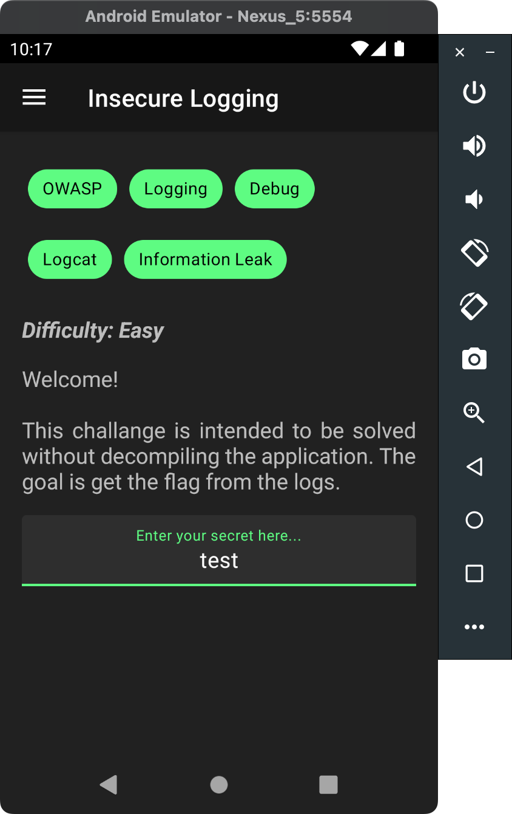

Insecure logging **occurs when sensitive data such as passwords and tokens are unintentionally stored in the device's memory**. Developers often use this method for testing and debugging purposes.





Make sure that you are connected to Android Device using `ADB` & use `logcat` tool to monitor the device log.

```sh
adb shell pidof -s infosecadventures.allsafe
adb logcat --pid 8184
```


![[1.2 insecure logging.png]]

**Vulnerable Code is visible here in JADX.**

![[1.3 insecure logging.png]]


